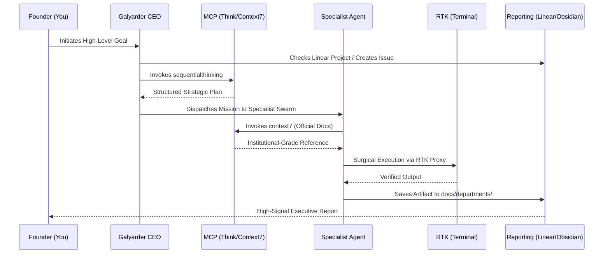

<p align="center">
  
</p>

<h1 align="center">Galyarder Framework</h1>

<p align="center">Humans 3.0 Protocol: Advanced Agentic Orchestration for the 1-Man Army</p>

<p align="center">
  Implementing <strong>Autonomous Goal Integration (AGI)</strong> to power self-evolving digital entities intelligence.
</p>

<p align="center">Built for the <strong>1-Man Army</strong> — one founder with the leverage of an entire company.</p>

---

## How it works

It starts from the moment you fire up your autonomous assistant (Galyarder Agent, OpenClaw, Hermes, or Claude Code). As soon as the framework sees that you're initiating a mission, it *doesn't* just jump into trying to execute tasks. Instead, it steps back and analyzes the high-level business intent behind your request. 

Once it's teased a comprehensive strategy out of the conversation, it presents it to you in structured segments short enough to actually verify and digest. 

After you've signed off on the direction, your agent puts together a mission-critical execution plan that's designed for deterministic precision. It emphasizes institutional-grade verification, lean operations (YAGNI), and systematic accuracy, ensuring every action provides maximum leverage toward your goal. 

Next up, once you say "go", it launches a *subagent-driven-orchestration* process, routing each engineering task through the host's available delegation model while preserving the same review and orchestration workflow. 

This is the **Humans 3.0** protocol in action: the transition from deterministic execution into **Autonomous Goal Integration (AGI)**. 

In this framework, AGI doesn't mean "sentient machines"; it means a self-evolving system capable of taking high-level business goals and independently orchestrating the entire lifecycle—from requirement extraction and high-integrity implementation to operational auditing and market distribution—without human micro-management. It's the ultimate realization of the **1-Man Army**: one founder providing the vision, while the framework provides the autonomous brain.

---

### The AGI Lifecycle (Professional Standard)

Galyarder Framework bridges the gap between high-level intent and ground-level execution through a deterministic 5-stage process:

1.  **Intent Extraction**: Distilling business goals into project-scoped Linear tickets and tactical specifications.
2.  **Strategic Blueprinting**: Mission design via formal verification and Vertical Slice (Tracer Bullet) implementation plans.
3.  **Autonomous Implementation**: Clinical execution via 40+ specialized logic engines and high-fidelity institutional standards.
4.  **Operational Auditing**: Automated live-environment verification and zero-trust security hardening.
5.  **Autonomous Distribution**: Programmatic asset generation and behavioral-targeted market deployment.

---

## What you get

A high-integrity workforce in a single repository:

- **40 Specialized Agents**: Engineering, Growth, Security, Product, and Legal experts.
- **Galyarder Neural Link (v2.0)**: Self-mapping knowledge graph with deterministic AST parsing and semantic inference.
- **132 Production-Ready Skills**: SOPs for TDD, SEO, CRO, FinOps, and more.
- **54 Design Specifications**: Elite UI specs (Stripe, Vercel, Apple) to enforce aesthetic law.
- **20+ Slash Commands**: Instant orchestration triggers (e.g., `/tdd`, `/review`, `/marketing`).
- **14+ Platform Compatibility**: Native support for Galyarder Agent, OpenClaw, Hermes, Claude Code, Gemini, and more.

---

## Usage: The High-Integrity Protocol

Galyarder Framework does not merely execute; it orchestrates. Every mission follows a non-negotiable sequence of high-fidelity protocols to ensure zero-slop output.

### 1. Operational Sequence (Visual)



### 2. The 1-Man Army Command Protocol

| Phase | Category | Action | Mandatory Tool | Outcome |
| :--- | :--- | :--- | :--- | :--- |
| **I** | **Traceability** | Alignment with Roadmap | **Linear** | Project-scoped issue locked & tracked. |
| **II** | **Cognition** | Socratic Deconstruction | **SequentialThinking** | 8-phase logic map with risk mitigation. |
| **III** | **Validation** | Official Reference Fetch | **Context7** | 100% accurate API & best practice alignment. |
| **IV** | **Execution** | Token-Efficient Actions | **RTK Proxy** | Surgical changes with verified TDD tests. |
| **V** | **Persistence** | Durable Memory Storage | **Obsidian** | Report pushed to Dept folder & C-Suite. |

---

## The Intelligence Layer of the Galyarder Ecosystem

Galyarder Framework is the underlying **brain** designed to power the next generation of autonomous entities.

-   **[Galyarder Agent](https://github.com/galyarderlabs/galyarder-agent)**: The **Entity**. Digital personas with recursive long-term memory, stable visual identity, and universal presence.
-   **[Galyarder HQ](https://github.com/galyarderlabs/galyarder-hq)**: The **Control Plane**. Master governance for orchestrating swarms and maintaining operational control.
-   **Galyarder Framework**: The **Intelligence**. The specialized workforce and elite SOPs.

---

## Installation: The Digital Company Protocol

Follow this sequence to transform any directory into a high-integrity Digital Company.

### Step 1: Global CLI Installation (One-Time)

Bootstrap the framework and link the core commands to your system's PATH. This allows you to run Galyarder commands from **any project** instantly.

```bash
# 1. Clone the intelligence layer
git clone https://github.com/galyarderlabs/galyarder-framework.git ~/galyarder-framework

# 2. Link commands globally
cd ~/galyarder-framework
./scripts/setup-cli.sh
```

### Step 2: Initialize & Deploy (Per Project)

Navigate to **your specific project** (e.g., `~/projects/my-app`) and deploy the workforce.

```bash
# 1. Initialize Digital Headquarters
galyarder-scaffold

# 2. Deploy Agents to your mission environment
# Available: cursor, windsurf, kilocode, augment, openclaw, hermes, antigravity, galyarder-agent
galyarder-deploy --tool <name>
```

---

## Managed & Autonomous Options

#### A. Official Marketplaces
*Recommended for rapid integration with cloud orchestrators.*

- **Claude Code**:
  ```bash
  /plugin marketplace add galyarderlabs/galyarder-framework
  /plugin install galyarder-framework@galyarderlabs-marketplace
  ```

  Or install departments selectively:

  ```bash
  /plugin install executive-dept@galyarderlabs-marketplace
  /plugin install engineering-dept@galyarderlabs-marketplace
  /plugin install growth-dept@galyarderlabs-marketplace
  /plugin install security-dept@galyarderlabs-marketplace
  /plugin install product-dept@galyarderlabs-marketplace
  /plugin install infrastructure-dept@galyarderlabs-marketplace
  /plugin install legal-finance-dept@galyarderlabs-marketplace
  /plugin install knowledge-dept@galyarderlabs-marketplace
  ```

- **Gemini CLI**:
  ```bash
  gemini extensions install https://github.com/galyarderlabs/galyarder-framework
  ```

#### B. Autonomous Directives (Codex / OpenCode)
*For tools that can autonomously fetch logic via direct instructions.*

- **OpenAI Codex**:
  Tell Codex: `Fetch and follow instructions from https://raw.githubusercontent.com/galyarderlabs/galyarder-framework/main/.codex/INSTALL.md`

- **OpenCode**:
  Tell OpenCode: `Fetch and follow instructions from https://raw.githubusercontent.com/galyarderlabs/galyarder-framework/main/.opencode/INSTALL.md`

---

## Philosophy

- **Verified Logic** — Output is a liability until it is systematically verified.
- **Context Economy** — RTK proxy usage is mandatory to maintain high-signal communication.
- **Math Over Magic** — Base decisions on empirical data, ROI, and institutional probability.
- **Goal to Market** — A mission is not complete until it achieves market-ready status.

---

## Technical Integrity: The Karpathy Principles

The framework enforces rigid adherence to the Karpathy Principles to eliminate slop:

- **Think Before Coding**: Mandatory `sequentialthinking` and `context7` MCP loops before any implementation.
- **Simplicity First**: Minimum effort to solve the objective. Zero speculative abstractions.
- **Surgical Changes**: Touch only what is necessary. Perfect alignment with existing infrastructure.
- **Goal-Driven Execution**: Empirical verification via a mission-first methodology.

---

## Digital Infrastructure: 8 High-Integrity Silos

The workforce is organized into specialized departments:

- **Executive**: Strategic oversight and master orchestration.
- **Engineering**: Deterministic implementation and TDD factory.
- **Growth**: Behavioral arbitrage, marketing engineering, and design systems.
- **Security**: Professional auditing and advanced offensive security.
- **Product**: Roadmap integrity and strategic extraction.
- **Infrastructure**: Reliability physics and automated deployment.
- **Legal-Finance**: Regulatory compliance and token FinOps.
- **Knowledge**: Memory preservation and visual logic mapping.

---

## What we are building next

We are currently engineering the next evolution of autonomous infrastructure, including cross-repo empire orchestration and automated revenue generation swarms.

👉 **[Join the Galyarder Early Access Waitlist](https://galyarderlabs.app/en#early-access)**

---

## Star History

<p align="center">
  <a href="https://star-history.com/#galyarderlabs/galyarder-framework&Date">
    
  </a>
</p>

---
© 2026 Galyarder Labs. Galyarder Framework. Engineering. Marketing. Distribution.
