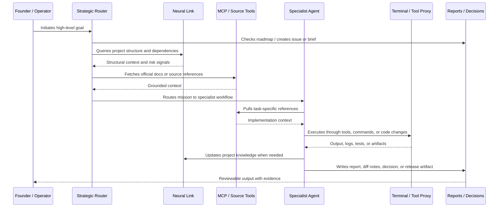

<p align="center">
  
</p>

<h1 align="center">Galyarder Framework</h1>

<p align="center"><strong>Open-source Agentic Company Framework.</strong></p>

<p align="center">
  Galyarder Framework is the Intelligence Layer of the Galyarder ecosystem: skills, agents, commands, review gates, and operating protocols for building an agentic company that remains inspectable, testable, and human-directed.
</p>

<p align="center">
  <a href="https://www.npmjs.com/package/galyarder-framework"></a>
  <a href="https://github.com/galyarderlabs/galyarder-framework/actions/workflows/deploy-docs.yml"></a>
  <a href="https://github.com/galyarderlabs/galyarder-framework/blob/main/LICENSE"></a>
</p>

<p align="center">
  
  
</p>

---

## What it is

Most AI-agent setups stop at chat or code generation. They can help with a task, but the work often stays loose: no durable scope, no department routing, no review gates, no audit trail, and no consistent way to move from strategy to implementation.

Galyarder Framework packages the missing operating layer. It gives autonomous agents a structured way to receive intent, route work to the right domain, produce plans, execute through tools, verify output, write reports, and hand control back to the operator.

It is not a kanban board, a prompt pack, or another coding agent. It is a framework for turning high-level operator intent into governed company execution.

---

## How it works

A typical mission follows the same path whether the work is engineering, marketing, finance, sales, documentation, legal, security, or strategy.

1. **Intent intake** — the operator describes a goal in plain language.
2. **Routing** — the framework maps the goal to the right department, agent, skill, command, and tool path.
3. **Blueprinting** — the agent turns the goal into a scoped plan, ticket, checklist, or execution brief.
4. **Implementation** — work is delegated to specialized agents, commands, and external tools where appropriate.
5. **Verification** — tests, reviews, source checks, audits, and evidence gates are run before completion claims.
6. **Reporting** — the result is written back as a useful artifact: code diff, docs, launch plan, security note, financial model, campaign, decision log, or operational report.


---

## Agentic company lifecycle

Galyarder Framework bridges the gap between intent and execution through a repeatable operating loop:

1. **Intent Extraction** — distill business goals into scoped specifications, tickets, or working briefs.
2. **Strategic Blueprinting** — design the mission with constraints, risks, success criteria, and execution sequence.
3. **Specialist Execution** — route work through domain agents, skills, commands, and tool adapters.
4. **Operational Auditing** — verify work through tests, security checks, source review, build checks, or evidence contracts.
5. **Distribution & Memory** — turn completed work into docs, release notes, reports, campaigns, decisions, and reusable knowledge.

---

## What you get

A multi-domain agentic company kit in one repository:

- **40+ specialized agents** across executive, engineering, growth, product, security, infrastructure, legal-finance, and knowledge work.
- **Department-based routing** so tasks move to the right specialist instead of staying in a generic assistant loop.
- **Production-ready skills and SOPs** for TDD, code review, SEO, CRO, FinOps, security review, documentation, release management, and more.
- **Slash commands** for common workflows such as `/tdd`, `/review`, `/marketing`, `/seo`, `/legal`, `/finops`, `/incident`, `/release`, and `/docs`.
- **Galyarder Neural Link** for repository mapping, dependency awareness, and knowledge-graph-oriented project context.
- **Design specifications** for consistent UI and product surfaces when agents produce frontend or brand-facing work.
- **Cross-tool compatibility** for Galyarder Agent, Claude Code, Gemini CLI, OpenClaw, Hermes Agent, Cursor, Windsurf, KiloCode, Augment, Antigravity, Codex-style installs, and OpenCode-style installs.

---

## Usage: governed execution protocol

Galyarder Framework does not ask the agent to “just do the task.” It gives the task a route, a plan, and a verification contract.

### 1. Operational sequence



### 2. Command protocol

| Phase | Category | Action | Typical tool | Outcome |
| :--- | :--- | :--- | :--- | :--- |
| **I** | **Traceability** | Align with roadmap or create a scoped issue | Linear / GitHub / local docs | Work has a named target. |
| **II** | **Mapping** | Inspect repo, dependencies, and prior knowledge | Neural Link / search tools | Agent knows the system before changing it. |
| **III** | **Planning** | Break the goal into steps and risks | Planning skill / sequential reasoning | Execution path is reviewable. |
| **IV** | **Grounding** | Fetch source docs and current references | Context7 / web / file tools | Claims and API usage are source-aligned. |
| **V** | **Execution** | Make the change or produce the artifact | CLI / editor / subagent / workflow tool | Work is created with minimal unnecessary surface area. |
| **VI** | **Verification** | Run tests, reviews, scans, or evidence checks | Test/build/security/docs tools | Completion is backed by output, not confidence. |
| **VII** | **Persistence** | Save the result where future work can use it | Docs / Obsidian / changelog / issue comment | Knowledge and decisions survive the session. |

---

## The Intelligence Layer of the Galyarder ecosystem

Galyarder Framework is one layer in a larger autonomous execution system:

- **[Galyarder Agent](https://github.com/galyarderlabs/galyarder-agent)** — the continuity and interface layer: memory, identity, channel presence, and tool access.
- **[Galyarder HQ](https://github.com/galyarderlabs/galyarder-hq)** — the command layer: company structure, goals, budgets, approval gates, reporting lines, and operational control.
- **Galyarder Framework** — the intelligence layer: agents, skills, commands, review gates, and execution protocols.
- **Galyarder Ledger** — the financial execution layer: agent-assisted, ledger-backed finance and operational evidence.

Framework can be used on its own, but it is designed to fit into an agentic-company stack where intent, execution, evidence, memory, and command stay connected.

---

## Installation

### Step 1: Global CLI installation

Bootstrap the framework and link the core commands to your system's PATH.

#### Option A: NPM (recommended)

Install directly from the global registry. This links the `galyarder` command and companion utilities.

```bash
npm install -g galyarder-framework
```

#### Option B: Skills.sh

Pull the full framework or a specific department bundle into an agent environment.

```bash
# Pull everything
npx skills add galyarderlabs/galyarder-framework --skill full

# Or pull by department, such as engineering, growth, security, product, or finance
npx skills add galyarderlabs/galyarder-framework --skill engineering
```

#### Option C: Git clone

Use the source directly when you want to inspect, modify, or contribute to the framework.

```bash
# 1. Clone the intelligence layer
git clone https://github.com/galyarderlabs/galyarder-framework.git ~/galyarder-framework

# 2. Link commands globally
cd ~/galyarder-framework
./scripts/setup-cli.sh
```

### Step 2: Initialize and deploy per project

Navigate to the project where you want to install the operating structure.

```bash
# 1. Initialize the project operating structure
galyarder scaffold

# 2. Deploy agents, rules, skills, and commands to your target tool
# Available: cursor, windsurf, kilocode, augment, openclaw, hermes, antigravity, galyarder-agent
galyarder deploy --tool <name>
```

---

## Managed and autonomous options

### A. Official marketplaces

Recommended when your coding environment supports plugin marketplaces or managed extensions.

#### Claude Code / Copilot CLI

```bash
# 1. Add the Galyarder Marketplace
/plugin marketplace add galyarderlabs/galyarder-framework

# 2. Install the full bundle
/plugin install galyarder-framework@galyarderlabs-marketplace

# Or install departments selectively
/plugin install executive-dept@galyarderlabs-marketplace
/plugin install engineering-dept@galyarderlabs-marketplace
# ...growth, security, product, infrastructure, legal-finance, knowledge
```

#### Gemini CLI

```bash
# Install
gemini extensions install https://github.com/galyarderlabs/galyarder-framework

# Update
gemini extensions update galyarder-framework

# Uninstall
gemini extensions uninstall galyarder-framework
```

The framework uses a universal plugin structure. Assets are organized into `agents/`, `skills/`, `commands/`, `personas/`, and `integrations/` so the same operating logic can be adapted across Google, Anthropic, Microsoft, OpenAI, and local-agent environments.

### B. Autonomous directives for Codex and OpenCode

For tools that can fetch instructions directly, point them at the install guides.

#### OpenAI Codex

```text
Fetch and follow instructions from https://raw.githubusercontent.com/galyarderlabs/galyarder-framework/main/.codex/INSTALL.md
```

#### OpenCode

```text
Fetch and follow instructions from https://raw.githubusercontent.com/galyarderlabs/galyarder-framework/main/.opencode/INSTALL.md
```

---

## Core principles

- **Human command first** — agents expand the operator's ability to act; they do not remove judgment or approval.
- **Ground before action** — inspect the repo, source docs, context, and constraints before making changes.
- **Smallest useful change** — solve the stated objective without speculative abstractions.
- **Evidence before completion** — tests, diffs, screenshots, logs, citations, or reports must back completion claims.
- **Reusable operating knowledge** — useful work should leave behind docs, skills, commands, tests, or decision records.
- **Goal to distribution** — a mission is not complete until the result can be reviewed, shipped, published, or used.

---

## Technical integrity

The framework encourages a disciplined engineering loop:

- **Think before coding** — use planning, source lookup, and explicit constraints before implementation.
- **Use official references** — fetch current docs for APIs, libraries, and platform behavior before relying on memory.
- **Prefer simple systems** — use the smallest architecture that satisfies the objective and can be maintained.
- **Make surgical changes** — touch only the files required for the outcome unless a broader refactor is intentional.
- **Verify the real path** — run tests, builds, lint, browser checks, security scans, or workflow-specific proof before calling work done.

---

## Departments

The framework organizes work into domain departments. These are routing surfaces for agents, skills, commands, and reports; `galyarder scaffold` may create `docs/departments/*` in a project as the output surface.

- **Executive** — strategy, prioritization, company direction, founder context, and decision logs.
- **Engineering** — architecture, implementation, TDD, code review, refactoring, and release readiness.
- **Product** — requirements, roadmaps, PRDs, experiments, product strategy, and user needs.
- **Growth** — marketing, content, SEO, CRO, analytics, campaigns, retention, and revenue workflows.
- **Sales** — technical sales, lead scoring, outreach assets, demos, qualification, and customer-facing material.
- **Finance / Legal** — financial analysis, pricing, contracts, compliance, privacy, and operating-risk review.
- **Security** — security review, threat modeling, secure automation, incident handling, and red-team planning.
- **Infrastructure** — deployment, reliability, observability, FinOps, CI/CD, and operational runbooks.
- **Knowledge** — documentation, Obsidian-style knowledge work, memory, diagrams, and durable reports.

---

## What we are building next

The next phase is to make the framework more concrete as an agentic-company operating layer:

- cleaner department bundles for engineering, product, growth, sales, finance, legal, security, docs, and operations;
- stronger examples that show a goal becoming a plan, issue, implementation, test, audit, and release artifact;
- safer Codex/OpenCode-style install and review workflows;
- better consolidation of open PRs into a smaller set of maintained release tracks.

👉 **[Join the Galyarder Early Access Waitlist](https://galyarderlabs.app/en#early-access)**

---

## Star History

<p align="center">
  <a href="https://star-history.com/#galyarderlabs/galyarder-framework&Date">
    
  </a>
</p>

---

© 2026 Galyarder Labs. Galyarder Framework. Agentic company execution infrastructure.
