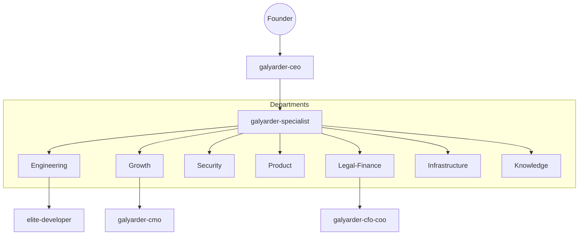

# Galyarder Framework: Digital Company OS

  

## The Humans 3.0 Infrastructure

Welcome to the command center of the Galyarder Digital Company. This portal provides deterministic documentation for history's first high-integrity AI workforce.

### Master Architecture

### Operational Silos

-   :material-account-tie: **Executive Office**
    ---
    C-Suite personas and master orchestration protocols.
    [View Agents](agents/index.md)

-   :material-hammer-wrench: **Engineering**
    ---
    Deterministic implementation and TDD factory.
    [View Skills](skills/index.md)

-   :material-trending-up: **Growth**
    ---
    Behavioral arbitrage and marketing engineering.
    [View Design](design/index.md)

-   :material-shield-lock: **Security**
    ---
    Offensive and defensive offensive security audits.
    [View Skills](skills/index.md)

## Key Protocols

1.  **Thinking MCP**: Mandatory structured reasoning via `sequentialthinking`.
2.  **Official Docs**: Real-time documentation fetch via `context7`.
3.  **Linear is Law**: No labor without a project-scoped ticket.
4.  **Obsidian Loop**: Durable memory in departmental reports.

---
Copyright 2026 Galyarder Labs. Galyarder Framework.
