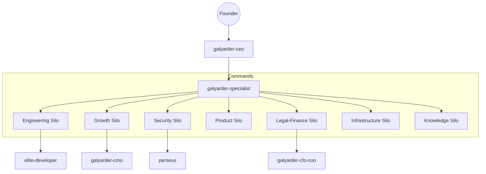

# Galyarder Framework: Advanced Agentic OS

  

## Humans 3.0: Autonomous Goal Integration

Galyarder Framework is the underlying **Logic Engine** and **Autonomous Workforce** designed to power the next generation of agentic entities. It provides the "brain" for autonomous assistants running locally, on VPS, or across distributed infrastructure.

### Global Command Architecture

### Institutional Departments

-   :material-account-tie: **Executive**
    ---
    Strategic oversight and master orchestration protocols.
    [Enter Command Silo](agents/index.md)

-   :material-hammer-wrench: **Engineering**
    ---
    Deterministic implementation and high-integrity TDD factory.
    [Enter Command Silo](skills/index.md)

-   :material-trending-up: **Growth**
    ---
    Behavioral arbitrage, marketing engineering, and design systems.
    [Enter Command Silo](design/index.md)

-   :material-shield-lock: **Security**
    ---
    Zero-trust auditing and advanced offensive security.
    [Enter Command Silo](skills/index.md)

## The 1-Man Army Global Protocols

To ensure institutional-grade output, every agent and skill within the framework enforces the following non-negotiable sequence:

1.  **Thinking MCP**: Mandatory structured reasoning via `sequentialthinking` before any tool call.
2.  **Official Documentation**: Real-time documentation fetch via `context7` to ensure 100% technical accuracy.
3.  **Traceability**: Every task must be linked to a project-scoped **Linear** ticket.
4.  **Token Economy**: Mandatory use of the `rtk` proxy to minimize computational overhead.
5.  **Persistence**: Every mission concludes with a durable markdown artifact in **Obsidian**.

---
© 2026 Galyarder Labs. Galyarder Framework. Engineering. Marketing. Distribution.
